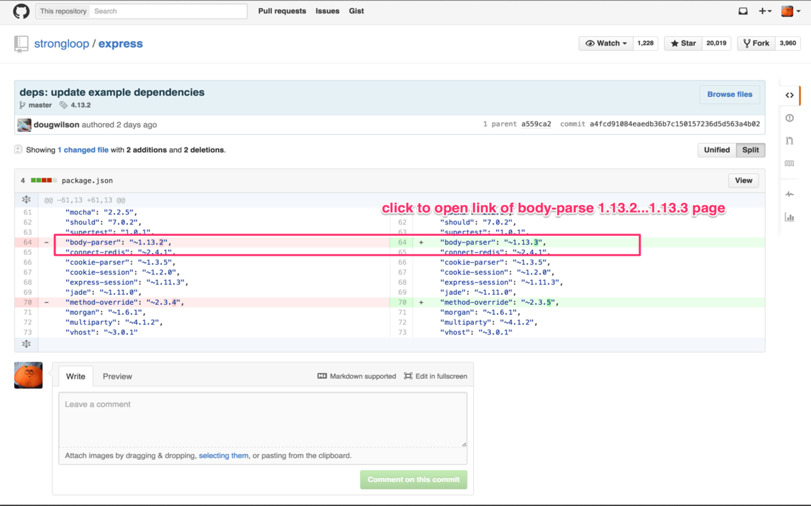

Github Library Changes
==========================

chrome extension for link to library change url on github.com.

install from chrome webstore: https://chrome.google.com/webstore/detail/github-library-changes/ljmngaaeiajncnnhnkpcllfkohhliljj?hl=ja

## Screenshot

## Features

 * Gemfile.lock(rubygems) support.
 * package.json(npm) support.
 * Podfile.lock (CocoaPods) support.

## Changes

### 2015-08-04 v0.0.2
  * support Podfile.lock (CocoaPods)
  * fixed not working on pull request page.

### 2015-08-03 v0.0.1
  * released v0.0.1

## License

Copyright (c) 2015 Keiji Yoshimi
Released under the MIT license
